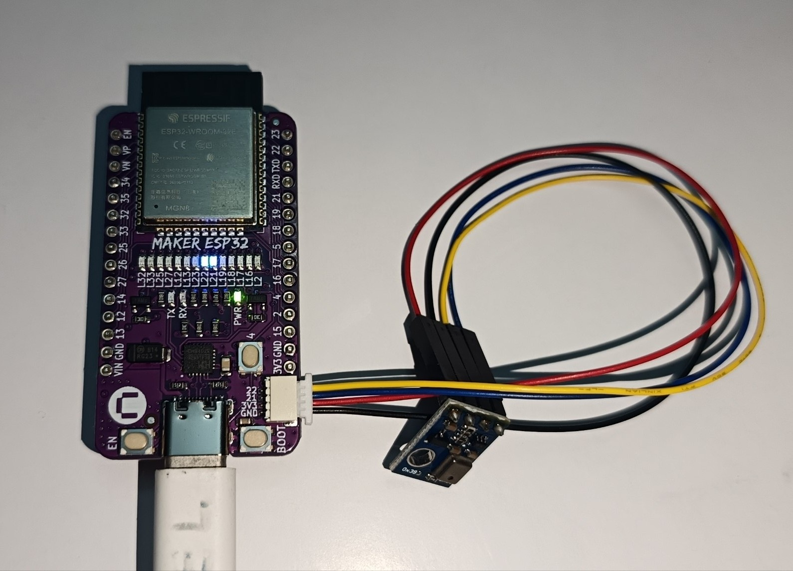
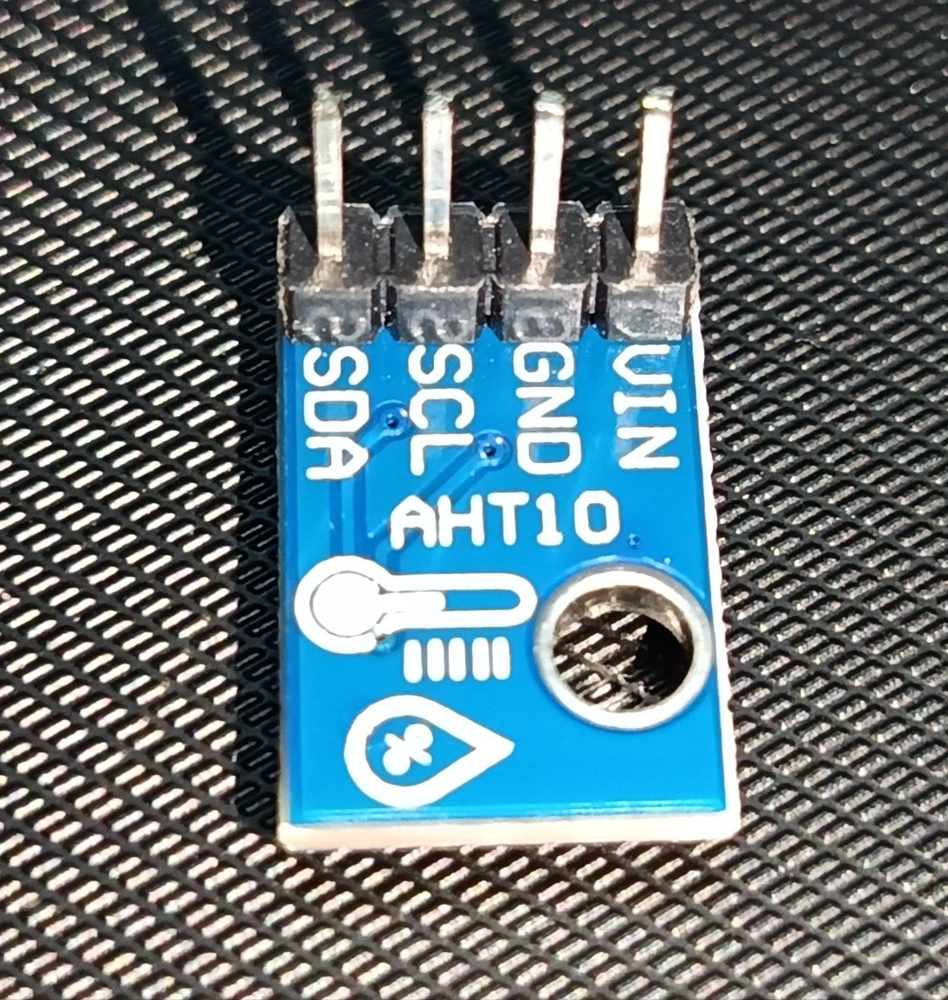

# Cytron Maker ESP32 – Buzzer Alarm & Environment Sensor (ESPHome)

This project configures a **Cytron Maker ESP32** running **ESPHome** integrated with Home Assistant[cite: 1, 7, 10]. It includes an **AHT10 Temperature & Humidity sensor** connected over I2C and a **fire alarm siren trigger** using the onboard piezo buzzer[cite: 1, 10].

## 🖼️ Hardware Gallery

| Maker ESP32 Board | AHT10 Sensor |
| :---: | :---: |
|  |  |

---

## 🛠️ Hardware Components

- **Development Board:** Cytron Maker ESP32 (ESP32-WROOM-32E)[cite: 10]
- **Buzzer:** Onboard Passive Piezo Buzzer connected to **GPIO26**[cite: 10]
- **Sensor:** AHT10 Temperature & Humidity Sensor connected via **Maker Port / I2C (SCL: GPIO22, SDA: GPIO21)**[cite: 1, 10]

---

## ⚡ Wiring & Pinout Guide

| Component | Pin / Connection | Notes |
| :--- | :--- | :--- |
| **Piezo Buzzer** | GPIO26 | Integrated onboard (ensure Mute Switch is UNMUTED)[cite: 10] |
| **AHT10 SCL** | GPIO22 | Connected via Maker Port or I2C Header[cite: 1, 10] |
| **AHT10 SDA** | GPIO21 | Connected via Maker Port or I2C Header[cite: 1, 10] |
| **AHT10 VCC** | 3.3V | Power[cite: 9, 10] |
| **AHT10 GND** | GND | Ground[cite: 9, 10] |

---

## 🚀 Setup Instructions

### Step 1: Clone the Repository
```bash
git clone [https://github.com/YOUR_USERNAME/YOUR_REPO_NAME.git](https://github.com/YOUR_USERNAME/YOUR_REPO_NAME.git)
cd YOUR_REPO_NAME
```

### Step 2: Configure `secrets.yaml`
1. Duplicate `secrets.yaml.example` and rename it to `secrets.yaml`.
2. Open `secrets.yaml` and fill in your network credentials:
   ```yaml
   wifi_ssid: "MyHomeWiFi"
   wifi_password: "MySecretPassword"
   api_encryption_key: "Generated_API_Key"
   ```

### Step 3: Install & Flash via ESPHome

#### Option A: Via Home Assistant ESPHome Dashboard (Recommended)
1. Copy `maker-esp32.yaml` into your Home Assistant `/config/esphome/` directory[cite: 4, 6].
2. Open the **ESPHome Dashboard** in Home Assistant[cite: 3].
3. Click **Install** $\rightarrow$ **Plug into this computer** or **On the network** (OTA)[cite: 5, 6].

#### Option B: Via ESPHome CLI
```bash
esphome run maker-esp32.yaml
```

---

## 🏠 Adding to Home Assistant

1. Once flashed and connected to Wi-Fi, Home Assistant will automatically discover the new device under **Settings $\rightarrow$ Devices & Services**[cite: 7].
2. Click **Configure** / **Add** on the discovered `maker esp32` integration[cite: 7].
3. Enter the encryption key if prompted[cite: 1].
4. Access entities:
   - `sensor.humidity` (AHT10)[cite: 1, 3]
   - `sensor.temperature` (AHT10)[cite: 1, 3]
   - `button.fire_alarm` (Triggers 5-second siren)[cite: 1]
